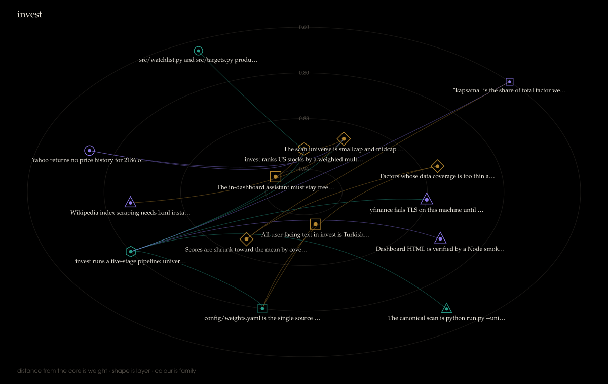

# PCNN — Project Context Neural Network

Context you earn in one AI coding session dies with that session. The next one
re-derives the same decisions, walks into the same platform limits, and now and
then quietly contradicts a choice you made a month ago.

PCNN keeps that context. Every durable fact about a project becomes one small
file with a fixed shape, linked to the other facts it depends on. Sessions load
it when they start and add to it when they end. Nothing is typed by hand.



That is a real project's network. Distance from the centre is how much a fact
matters, shape is what kind of fact it is, colour is which family it belongs to.

## A fact looks like this

```
@neuron INVEST.DEC-007
head: Ranking is cached per trading day because the quote API bills per call
layer: DEC
salience: 0.92
signals: caching, quote-api, rate-limit, ranking
description: The pipeline writes its scored output to cache/ranking-<date>.json and
  reuses it for the rest of the trading day. The upstream API bills per call and
  rate-limits above 500 requests an hour, which a full re-rank exceeds.
rationale: A full re-rank costs more in API calls than a day-old ranking costs in accuracy.
alternatives_rejected: in-memory cache (lost on restart); no cache (hits the rate limit)
anchors: pipeline/rank.py:88-140
connected.INVEST.DEC-007 -> INVEST.CON-003 : constrained_by w=1.00
```

Facts sit in one of eleven layers — what the project is, a decision, a rule that
must hold, a component, a module, a data shape, how to run it, something that
broke, an open thread, a term of art, a pattern shared across projects — and are
joined by one of twelve kinds of link.

## Nothing loses weight

The failure this exists to prevent is a fact going quiet until it may as well be
gone. So:

- one fact per file, and a rewrite that drops more than 40% of it is refused
- every layer has a floor its facts can never sink below
- **no decay over time** — a decision from day one still outranks today's rename
- weight only ever rises on its own; lowering it takes a command and a written reason
- facts are superseded, never deleted, and retired ones are listed so an
  abandoned approach is not rediscovered as new

## Asking it things

```
$ python -m pcnn query invest "why is the ranking cached"

INVEST.DEC-007 | a=1.14 | s=0.92 | DEC | direct
    Ranking is cached per trading day because the quote API bills per call
    anchors: pipeline/rank.py:88-140
INVEST.CON-003 | a=0.91 | s=1.00 | CON | 1-hop via INVEST.DEC-007
    The quote API rate-limits above 500 requests per hour
```

The second answer is the point. Nothing in the question mentioned rate limits;
it surfaced because the first answer depends on it.

## What it costs

Nothing, on the normal path. No model runs to keep the network current.

A session that just spent an hour in your code already knows what it decided and
is already writing a closing message. A hook asks it to end that message with a
short block, and another hook reads the block and files the facts. Paying a
second model to read the transcript and work the same things out again buys the
same knowledge twice, and the second copy is worse — guessed from evidence
rather than remembered.

| | |
|---|---|
| Session start | about 5k tokens: the rules, the map, and how to report back |
| Session end | nothing |
| Nightly tidy-up and redraw | nothing |
| A day no session reported on | optional, about 7k tokens on Haiku |
| Ceiling if you turn that on | 30 calls a day, all projects (`PCNN_DAILY_CALLS`) |

`python -m pcnn cost` shows what has actually been spent.

## Day to day

You type nothing. Hooks handle both ends of a session. At 23:30 — only on days
you actually opened one — a scheduled task tidies up, redraws, shows one
notification and exits in a few seconds.

When you do want to look:

```
$ python -m pcnn

project   facts  live  waiting  state
invest       15    15       22  sound
pcnn         43    38        0  sound

model calls today: 0 of 30
the picture: output/network.html
```

## Setting it up

Python 3, standard library only. Nothing to install.

```
python -m pcnn init invest "C:/path/to/invest"
```

Then point the two hooks at it in `~/.claude/settings.json`:

```json
{
  "hooks": {
    "SessionStart": [{ "hooks": [{ "type": "command", "command": "python",
                                   "args": ["<PCNN>/hooks/session_start.py"] }] }],
    "SessionEnd":   [{ "hooks": [{ "type": "command", "command": "python",
                                   "args": ["<PCNN>/hooks/session_end.py"] }] }]
  }
}
```

And register the nightly task:

```
powershell -ExecutionPolicy Bypass -File scripts\install-nightly.ps1
```

To fill a network from a project that already exists, run
`prompts/INGEST_PROJECT.md` inside it, then `prompts/TRANSDUCE.md` here.
`python -m pcnn audit <project>` will tell you what percentage of the intake
made it across.

The hooks are cross-platform; the scheduled task and the notification are
Windows. On macOS or Linux, run `python scripts/nightly.py` from cron.

## The view

`output/<project>.html` is one self-contained file — no CDN, no web font, no
build step, so it still opens from a disk years from now. Click a neuron to read
it in full. Hold shift and pick two to trace what joins them. There is a search
box, layer filters, a table view, and a slider that replays how the project grew.

`python -m pcnn poster <project>` writes the still image at the top of this page.

## Commands

`python -m pcnn` on its own is the dashboard and costs nothing. The rest are
there when you want them: `init`, `query`, `context`, `audit`, `render`,
`poster`, `cost`, `distill`, `apply`, `consolidate`, `demote`, `suggest`,
`validate`, `rebuild`, `harvest`, `status`.

## Layout

```
pcnn/            the engine
prompts/         four prompts: onboarding, conversion, distillation, session rules
networks/<name>/ MAP.md · INVARIANTS.md · neurons/ · recaps/ · CHANGELOG.ndjson
hooks/           session_start.py · session_end.py
output/          the generated views
```

`networks/pcnn/` is this system's description of itself, kept here as a worked
example. Your own projects' networks stay on your machine — they are gitignored,
because they describe private code. Run `scripts/scrub.py` before publishing one.

## Tests

```
python -m unittest discover tests
```

65 of them, written against the promises rather than the implementation: a fact
never shrinks, weight never falls on its own, a bad update never lands, a broken
transcript never breaks a session.
